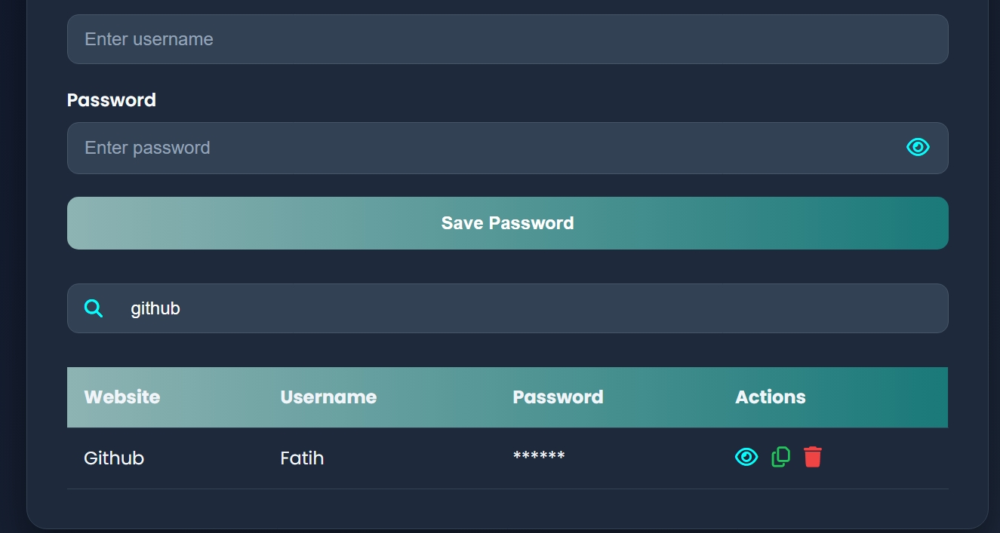
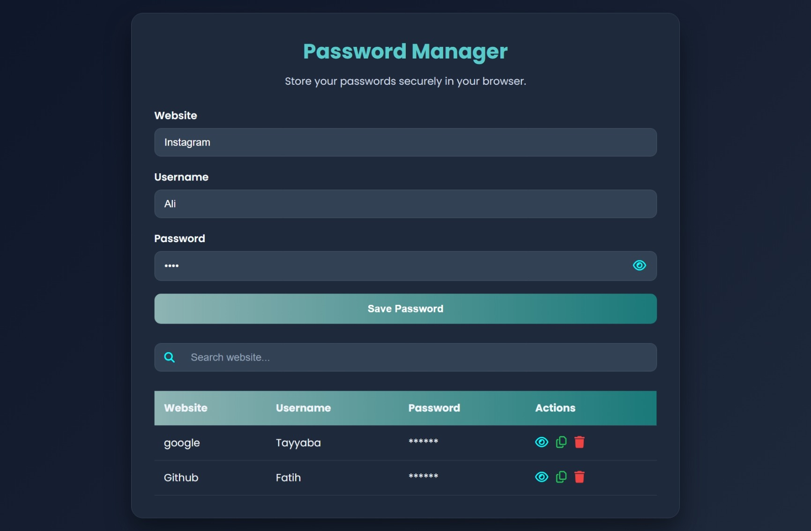

# Password Manager

A responsive Password Manager built with **HTML, CSS, and JavaScript**. This project allows users to securely save and manage their passwords in the browser using Local Storage.

## Live Demo

**View the project here:**
https://password-manager-theta-two.vercel.app/

---

## Features

- Add new passwords
- Display saved passwords in a table
- Search passwords by website
- Show and hide passwords
- Copy passwords to the clipboard
- Delete saved passwords
- Store data using Local Storage
- Responsive user interface

---

## Built With

- HTML5
- CSS3
- JavaScript (ES6)
- Font Awesome

---

## Folder Structure

```text
Password-Manager/
│── index.html
│── style.css
│── script.js
└── README.md
```

---

## Running the Project Locally

1. Clone the repository:

```bash
git clone https://github.com/Tayyaba-Amin/Password-Manager
```

2. Open the project folder.
3. Open `index.html` in your browser.

No additional packages or installation steps are required.

---

## Concepts Practiced

- DOM Manipulation
- Event Handling
- Arrays and Objects
- Functions
- Local Storage
- Clipboard API
- Dynamic UI Updates
- Search and Filtering
- Responsive Design

---

## Preview

<p align="center">
  
</p>
<p align="center">
  
</p>

---

## Author

**Tayyaba Amin**
GitHub: https://github.com/Tayyaba-Amin
LinkedIn: https://www.linkedin.com/in/tayyaba-amin/

---

## License

This project was built for learning and educational purposes.
